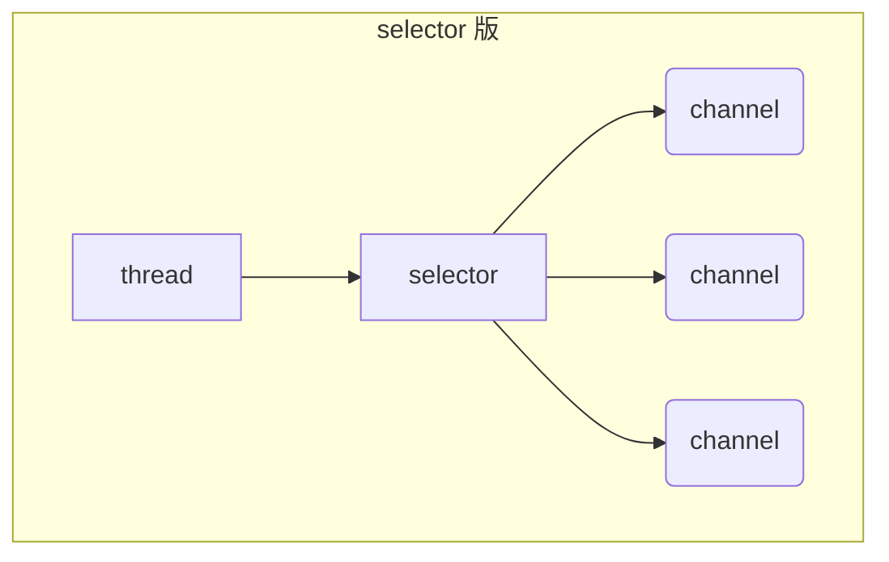

# <center> 标题栏居中</center>

## 颜色
浅红色文字：<font color="#dd0000">浅红色文字：</font><br/> 
深红色文字：<font color="#660000">深红色文字</font><br /> 
浅绿色文字：<font color="#00dd00">浅绿色文字</font><br /> 
深绿色文字：<font color="#006600">深绿色文字</font><br /> 
浅蓝色文字：<font color="#0000dd">浅蓝色文字</font><br /> 
深蓝色文字：<font color="#000066">深蓝色文字</font><br /> 
浅黄色文字：<font color="#dddd00">浅黄色文字</font><br /> 
深黄色文字：<font color="#666600">深黄色文字</font><br /> 
浅青色文字：<font color="#00dddd">浅青色文字</font><br /> 
深青色文字：<font color="#006666">深青色文字</font><br /> 
浅紫色文字：<font color="#dd00dd">浅紫色文字</font><br /> 
深紫色文字：<font color="#660066">深紫色文字</font><br />

```markdown
## 颜色
浅红色文字：<font color="#dd0000">浅红色文字：</font><br/> 
深红色文字：<font color="#660000">深红色文字</font><br /> 
浅绿色文字：<font color="#00dd00">浅绿色文字</font><br /> 
深绿色文字：<font color="#006600">深绿色文字</font><br /> 
浅蓝色文字：<font color="#0000dd">浅蓝色文字</font><br /> 
深蓝色文字：<font color="#000066">深蓝色文字</font><br /> 
浅黄色文字：<font color="#dddd00">浅黄色文字</font><br /> 
深黄色文字：<font color="#666600">深黄色文字</font><br /> 
浅青色文字：<font color="#00dddd">浅青色文字</font><br /> 
深青色文字：<font color="#006666">深青色文字</font><br /> 
浅紫色文字：<font color="#dd00dd">浅紫色文字</font><br /> 
深紫色文字：<font color="#660066">深紫色文字</font><br />
```


## 加粗
**加粗** `**加粗** `    
__加粗__ `__加粗__ `    
_斜体_ `_斜体_`


如果你想让字体在加粗的情况下颜色也有变化，这就需要扩充语法，一般会选用Html语法来进行标记。

<b>加粗</b> `<b>加粗</b>`

<strong>加粗</strong> `<strong>加粗</strong>`


# 页内跳转

<a id="table1">Table - 1</a> 

<a id="table2">Table - 2</a> 

## 填充文本

excellent

excellent

excellent

excellent

excellent

excellent


# 实现跳转

[跳转到 Table-1](#table1)

[跳转到 Table-2](#table2)

<a href="#table1">跳转到 Table-1</a>

<a href="#table2">跳转到 Table-2</a>





常用符号
✅


## 图片并排

 | 
---|---

## 图片大小


# <center>代码笔记规范</center>

你可以使用markdown语法来记录你的函数和方法。下面是一个例子：

## 函数名

### 描述

这里写函数的描述。

### 语法

```csharp
// 这里写函数的语法。
参数
这里写函数的参数列表。

返回值
这里写函数的返回值。

示例
这里写函数的示例。


你可以根据自己的需要来调整格式，让它看起来更整齐。


你可以使用markdown语法来记录你的代码中的变量和属性。下面是一个例子：

## 变量名

### 描述

这里写变量的描述。

### 语法

```csharp
// 这里写变量的语法。
示例
这里写变量的示例。


对于像 `gameObject.name` 这样的属性，你可以将其视为一个只读属性，然后像上面那样记录它。
```

- awdd
- awda
	- awd
