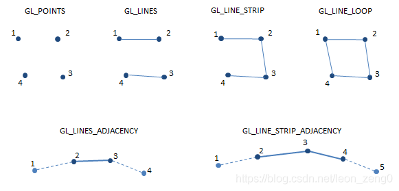

# learnopengl 学习笔记

OpenGL 4.5 在 OpenGL 3.3 的基础上增加了很多新特性。例如：

    多级纹理，允许将多个纹理绑定在一起，从而使用更多的纹理数据进行图形渲染。

    静态着色器，允许在编译时预先编译着色器，从而加快渲染速度。

    动态着色器，允许在运行时动态修改着色器，从而使着色器能够更灵活地适应不同的渲染需求。

    增强的 Tessellation 功能，允许对图形进行更精细的细分，从而提高渲染质量。

    新增的视口多段投影功能，允许使用多个视口进行投影，从而提高渲染效率。

    增强的半精度浮点运算能力，使得 OpenGL 4.5 可以使用半精度浮点数进行更复杂的图形渲染。

    增强的顶点格式支持，使得 OpenGL 4.5 可以更灵活地处理不同类型的顶点数据。

    这些只是 OpenGl 4.5 的部分新特性，实际上还有很多其他新功能，例如对调试和优化的增强支持等。

# 顶点和索引
+ glVertexAttribPointer     指定了渲染时索引值为 index 的顶点属性数组的数据格式和位置。
index 指定要配置的顶点属性的编号。
    + size 指定每个顶点属性的分量数（1、2、3 或 4，就像向量的维度一样）。
    + type 指定每个分量的数据类型，可以是 GL_BYTE、GL_UNSIGNED_BYTE、GL_SHORT、GL_UNSIGNED_SHORT、GL_INT、GL_UNSIGNED_INT、GL_FLOAT 或 GL_DOUBLE。
    + normalized1 指定是否将数据归一化到 [0,1] 或 [-1,1] 范围内。
    + stride （步长）指定连续两个顶点属性间的字节数。如果为 0，则表示顶点属性是紧密排列的。
    + pointer 指向缓冲对象中第一个顶点属性的第一个分量的地址。（offset的作用）


# shader.h
```glsl
Shader ourShader("path/to/shaders/shader.vs", "path/to/shaders/shader.fs");
...
while(...)
{
    ourShader.use();
    ourShader.setFloat("someUniform", 1.0f);
    DrawStuff();
}
```

## glDrawArrays , glDrawElements

`glDrawArrays` 和 `glDrawElements` 的作用都是从一个数据数组中提取数据渲染基本图元。

使用区别：

gl.glDrawArrays 设置顶点和纹理buffer的时候，位置已经写好了

gl.glDrawElements order是按照你设置的顶点和纹理的顺序

性能区别：

glDrawArrays 传输或指定的数据是最终的真实数据,在绘制时效能更好
glDrawElements 指定的是真实数据的调用索引,在内存/显存占用上更节省

glDrawArrays 和 glDrawElements的损耗说明及其使用场景

glDrawArrays 主要讲数据空间损耗在顶点的定义处;
glDrawElements 主要讲数据空间损耗在顶点索引的定义处;
如果在你的工程中，画的图形较少或者，图形虽多但很多相同的，则可采用glDrawArrays更节省数据占用的空间；相反，如果图形多，而且形状大不相同的时候，可以优先考虑采用glDrawElements函数。

glDrawArrays , glDrawElements 这两个方法的第一个形参都是代表 绘制模式(GLenum mode)。绘图模式有如下几种：

`GL_POINTS`， `GL_LINE_STRIP`， `GL_LINE_LOOP`， `GL_LINES`， `GL_LINE_STRIP_ADJACENCY`，`GL_LINES_ADJACENCY`， `GL_TRIANGLE_STRIP`，`GL_TRIANGLE_FAN`， `GL_TRIANGLES`，`GL_TRIANGLE_STRIP_ADJACENCY`，`GL_TRIANGLES_ADJACENCY` and `GL_PATCHES`

其中 `GL_LINE_STRIP_ADJACENCY`，`GL_LINES_ADJACENCY`，`GL_TRIANGLE_STRIP_ADJACENCY`  和`GL_TRIANGLES_ADJACENCY`，只有3.2后才支持。

    GL_POINTS - 单独的将顶点画出来。

    GL_LINES - 单独地将直线画出来。行为和 GL_TRIANGLES 类似。

    GL_LINE_STRIP - 连贯地将直线画出来。行为和 GL_TRIANGLE_STRIP 类似。

    GL_LINE_LOOP - 连贯地将直线画出来。行为和 GL_LINE_STRIP 类似，但是会自动将最后一个顶点和第一个顶点通过直线连接起来。

    GL_TRIANGLES - 这个参数意味着OpenGL使用三个顶点来组成图形。所以，在开始的三个顶点，将用顶点1，顶点2，顶点3来组成一个三角形。完成后，在用下一组的三个顶点(顶点4，5，6)来组成三角形，直到数组结束。

    GL_TRIANGLE_STRIP - OpenGL的使用将最开始的两个顶点出发，然后遍历每个顶点，这些顶点将使用前2个顶点一起组成一个三角形。

 | 
---|---

## Z缓冲

OpenGL存储它的所有深度信息于一个Z缓冲(Z-buffer)中，也被称为深度缓冲(Depth Buffer)。GLFW会自动为你生成这样一个缓冲（就像它也有一个颜色缓冲来存储输出图像的颜色）。深度值存储在每个片段里面（作为片段的z值），当片段想要输出它的颜色时，OpenGL会将它的深度值和z缓冲进行比较，如果当前的片段在其它片段之后，它将会被丢弃，否则将会覆盖。这个过程称为深度测试(Depth Testing)，它是由OpenGL自动完成的。

然而，如果我们想要确定OpenGL真的执行了深度测试，首先我们要告诉OpenGL我们想要启用深度测试；它默认是关闭的。我们可以通过`glEnable`函数来开启深度测试。`glEnable`和`glDisable`函数允许我们启用或禁用某个OpenGL功能。这个功能会一直保持启用/禁用状态，直到另一个调用来禁用/启用它。现在我们想启用深度测试，需要开启`GL_DEPTH_TEST：`

```c++
glEnable(GL_DEPTH_TEST);
...

// 主函数循环
while (!glfwWindowShouldClose(main_window))
{
    /* 因为我们使用了深度测试，我们也想要在每次渲染迭代之前清除深度缓冲（否则前一帧的深度信息仍然保存在缓冲中）。
    就像清除颜色缓冲一样，我们可以通过在glClear函数中指定DEPTH_BUFFER_BIT位来清除深度缓冲 */
    glClear(GL_COLOR_BUFFER_BIT | GL_DEPTH_BUFFER_BIT);
}

```

### glUniformMatrix4fv
我们首先查询`uniform`变量的地址，然后用有`Matrix4fv`后缀的`glUniform`函数把矩阵数据发送给着色器，第二个参数告诉OpenGL我们将要发送多少个矩阵，第三个参数询问我们是否希望对我们的矩阵进行转置(Transpose)，也就是说交换我们矩阵的行和列。OpenGL开发者通常使用一种内部矩阵布局，叫做列主序(Column-major Ordering)布局。GLM的默认布局就是列主序，所以并不需要转置矩阵，我们填`GL_FALSE`。后一个参数是真正的矩阵数据，但是GLM并不是把它们的矩阵储存为OpenGL所希望接受的那种，因此我们要先用GLM的自带的函数`value_ptr`来变换这些数据。

~~~ c++
// 变换矩阵
glUniformMatrix4fv(modelLoc, 1, GL_FALSE, glm::value_ptr(model));
// 观察矩阵
glUniformMatrix4fv(view_loc, 1, GL_FALSE, &view[0][0]);
~~~
> 如果已经下载了 `shader.h` 这个头文件将不用手写 `glUniformMatrix4fv` 直接使用 `ourShader.setMat4("矩阵", 矩阵);`

# glm
**glm::perspective**
```
glm::mat4 proj = glm::perspective(glm::radians(45.0f), (float)width / (float)height, 0.1f, 100.0f);
```
第一个参数 `glm::radians(45.0f)` 代表视野(Field of View) 数值越大视野更宽。     
第二个参数设置了宽高比，由视口的宽除以高所得。  
第三和第四个参数设置了平截头体的近和远平面(最近最远渲染距离)。

# 入门章节关键字复习

+ **OpenGL：** 一个定义了函数布局和输出的图形API的正式规范。
+ **GLAD：** 一个拓展加载库，用来为我们加载并设定所有OpenGL函数指针，从而让我们能够使用所有（现代）OpenGL函数。
+ **视口(Viewport)：** 我们需要渲染的窗口。
+ **图形管线(Graphics Pipeline)：** 一个顶点在呈现为像素之前经过的全部过程。
+ **着色器(Shader)：** 一个运行在显卡上的小型程序。很多阶段的图形管道都可以使用自定义的着色器来代替原有的功能。
+ **标准化设备坐标(Normalized Device Coordinates, NDC)：** 顶点在通过在剪裁坐标系中剪裁与透视除法后最终呈现在的坐标系。所有位置在NDC下-1.0到1.0的顶点将不会被丢弃并且可见。
+ **顶点缓冲对象(Vertex Buffer Object)：** 一个调用显存并存储所有顶点数据供显卡使用的缓冲对象。
+ **顶点数组对象(Vertex Array Object)：** 存储缓冲区和顶点属性状态。
+ **元素缓冲对象(Element Buffer Object，EBO)**，也叫索引缓冲对象(Index Buffer Object，IBO)： 一个存储元素索引供索引化绘制使用的缓冲对象。
+ **Uniform：** 一个特殊类型的GLSL变量。它是全局的（在一个着色器程序中每一个着色器都能够访问uniform变量），并且只需要被设定一次。
+ **纹理(Texture)：** 一种包裹着物体的特殊类型图像，给物体精细的视觉效果。
+ **纹理缠绕(Texture Wrapping)：** 定义了一种当纹理顶点超出范围(0, 1)时指定OpenGL如何采样纹理的模式。
+ **纹理过滤(Texture Filtering)：** 定义了一种当有多种纹素选择时指定OpenGL如何采样纹理的模式。这通常在纹理被放大情况下发生。
+ **多级渐远纹理(Mipmaps)：** 被存储的材质的一些缩小版本，根据距观察者的距离会使用材质的合适大小。
+ **stb_image.h：** 图像加载库。
+ **纹理单元(Texture Units)：** 通过绑定纹理到不同纹理单元从而允许多个纹理在同一对象上渲染。
+ **向量(Vector)：** 一个定义了在空间中方向和/或位置的数学实体。
+ **矩阵(Matrix)：** 一个矩形阵列的数学表达式。
+ **GLM：** 一个为OpenGL打造的数学库。
+ **局部空间(Local Space)：** 一个物体的初始空间。所有的坐标都是相对于物体的原点的。
+ **世界空间(World Space)：** 所有的坐标都相对于全局原点。
+ **观察空间(View Space)：** 所有的坐标都是从摄像机的视角观察的。
+ **裁剪空间(Clip Space)：** 所有的坐标都是从摄像机视角观察的，但是该空间应用了投影。这个空间应该是一个顶点坐标最终的空间，作为顶点着色器的输出。OpenGL负责处理剩下的事情（裁剪/透视除法）。
+ **屏幕空间(Screen Space)：** 所有的坐标都由屏幕视角来观察。坐标的范围是从0到屏幕的宽/高。
+ **LookAt矩阵：** 一种特殊类型的观察矩阵，它创建了一个坐标系，其中所有坐标都根据从一个位置正在观察目标的用户旋转或者平移。
+ **欧拉角(Euler Angles)：** 被定义为偏航角(Yaw)，俯仰角(Pitch)，和滚转角(Roll)从而允许我们通过这三个值构造任何3D方向。

# 冯氏光照模型


+ 环境光照(Ambient Lighting)：即使在黑暗的情况下，世界上通常也仍然有一些光亮（月亮、远处的光），所以物体几乎永远不会是完全黑暗的。为了模拟这个，我们会使用一个环境光照常量，它永远会给物体一些颜色。

+ 漫反射光照(Diffuse Lighting)：模拟光源对物体的方向性影响(Directional Impact)。它是冯氏光照模型中视觉上最显著的分量。物体的某一部分越是正对着光源，它就会越亮。

+ 镜面光照(Specular Lighting)：模拟有光泽物体上面出现的亮点。镜面光照的颜色相比于物体的颜色会更倾向于光的颜色。

## 片段着色器中的计算

↓ 环境光照
~~~glsl
float ambientStrength = 0.1;
vec3 ambient = ambientStrength * lightColor;
~~~
↓ 漫反射光照
~~~glsl
vec3 norm = normalize(Normal);
vec3 lightDir = normalize(lightPos - FragPos);
float diff = max(dot(norm, lightDir), 0.0);
vec3 diffuse = diff * lightColor;
~~~
↓ 镜面光照（高光）
~~~glsl
float specularStrength = 0.5;
vec3 viewDir = normalize(viewPos - FragPos);
vec3 reflectDir = reflect(-lightDir, norm);
float spec = pow(max(dot(viewDir, reflectDir), 0.0), 32);
vec3 specular = specularStrength * spec * lightColor;
~~~

↓ 合并
~~~glsl
vec3 result = (ambient + diffuse + specular) * objectColor;
FragColor = vec4(result, 1.0);
~~~

`pow()`幂函数中填入如下值↓


# 纹理加载（stb_image.h）

1. 在加载纹理之前我们先要使用OpenGL中的 `glVertexAttribPointer` 函数指定渲染时索引值，指定我们的UV信息。
    ~~~c++
    glVertexAttribPointer(2, 2, GL_FLOAT, GL_FALSE, 8 * sizeof(float), (void *)(6 * sizeof(float)));
    glEnableVertexAttribArray(2);
    ~~~

2. 在顶点着色器中我们需要传入 `glEnableVertexAttribArray` 这个函数中的参数
    ~~~ glsl
    // 为UV位置变量的属性位置值为2
    layout (location = 2) in vec2 aTexCoords;
    // 把顶点坐标传给片段着色器
    out vec2 TexCoords;

    void main() {
        TexCoords = aTexCoords;
        ...
    }
    ~~~
    片段着色器中输入
    ~~~glsl
    in vec2 TexCoords;

    uniform sampler2D ourTexture;

    void main() {
        FragColor = texture(ourTexture, TexCoord);
    }
    ~~~

3. 纹理加载部分
    ~~~c++
    unsigned int texture;
    glGenTextures(1, &texture);
    glBindTexture(GL_TEXTURE_2D, texture);
    // 设置纹理环绕方式
    glTexParameteri(GL_TEXTURE_2D, GL_TEXTURE_WRAP_S, GL_REPEAT);
    glTexParameteri(GL_TEXTURE_2D, GL_TEXTURE_WRAP_T, GL_REPEAT);
    // 设置多级渐远纹理
    glTexParameteri(GL_TEXTURE_2D, GL_TEXTURE_MIN_FILTER, GL_LINEAR_MIPMAP_LINEAR);
    glTexParameteri(GL_TEXTURE_2D, GL_TEXTURE_MAG_FILTER, GL_LINEAR);
    // 加载纹理
    int width, height, nr_channels;
    unsigned char* data = stbi_load("./asset/image/container2.png", &width, &height, &nr_channels, 0);
    if (data) 
    {
        glTexImage2D(GL_TEXTURE_2D, 0, GL_RGBA, width, height, 0, GL_RGBA, GL_UNSIGNED_BYTE, data);
        glGenerateMipmap(GL_TEXTURE_2D);
    }
    else {
        cout << "无法加载纹理" << endl;
    }
    // 释放图像的内存
    stbi_image_free(data);
    ~~~

4. 在wihile循环中绘制
    ~~~c++
    glBindTexture(GL_TEXTURE_2D, texture);
    glBindVertexArray(cube_vao);
    glDrawArrays(GL_TRIANGLES, 0, 36);
    ~~~