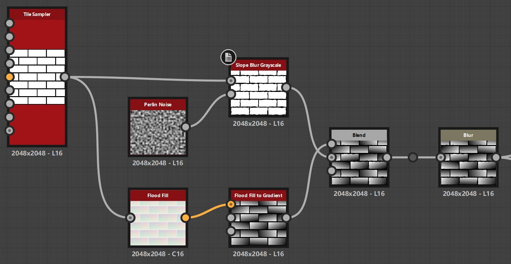
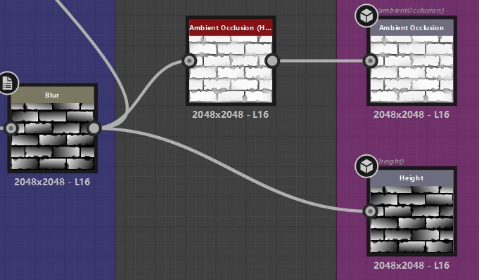
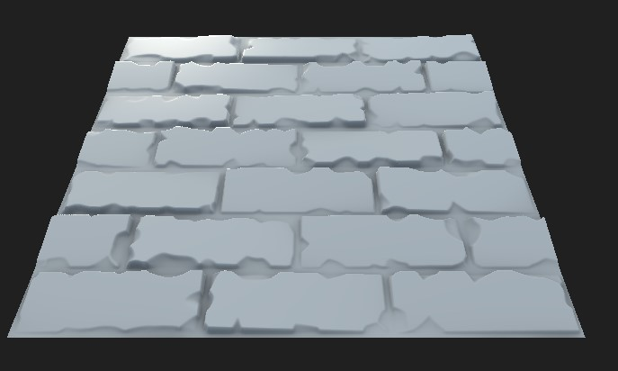
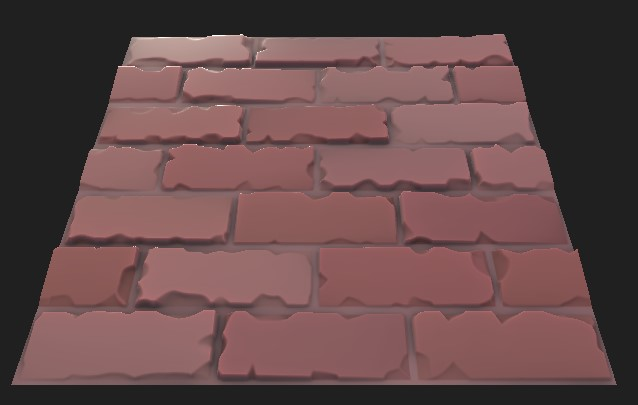
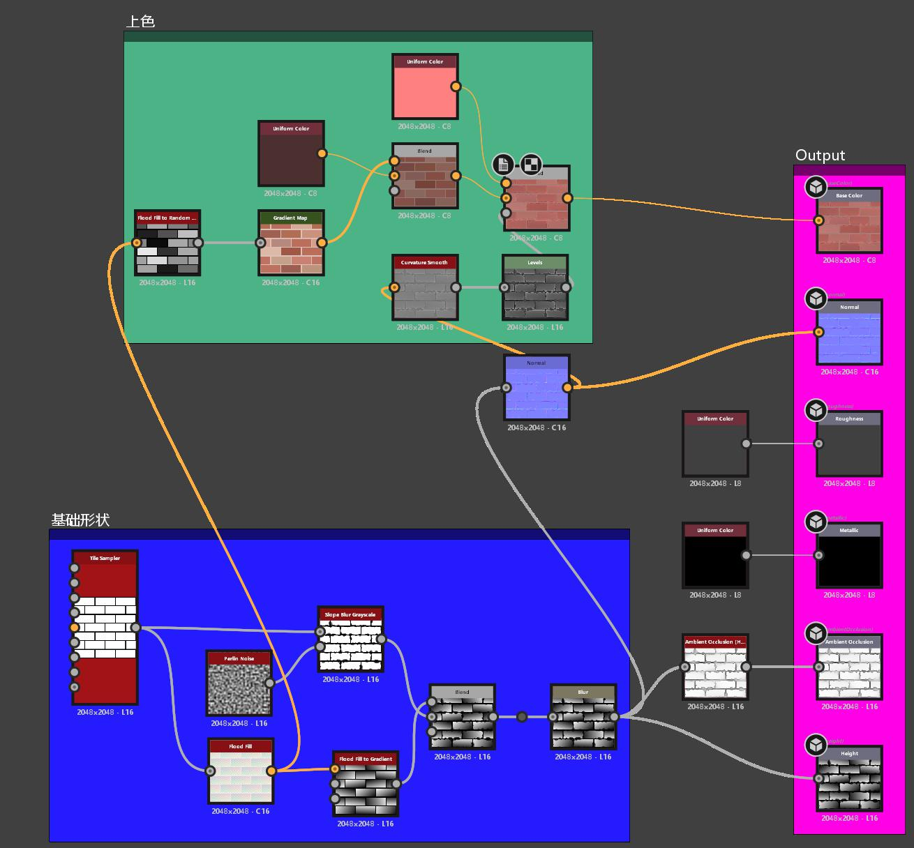

# 看前须知
0. 看本文档前请掌握Substance Designer的基础操作以及一些常用节点的用法，文档主要提供一些基础相对简单的案列。
1. 可选择或可填入参数都使用 如 `Square` ，`True`，`Flase` 等代码块样式，数字也是如此：`1.2`，`0`，`1` 等。
2. 节点名称使用加粗斜体 如： ***Tile Sampler***
3. 节点的输入输出点的名称也使用如 `Output`，`Slope` 等方式。

# 石墙/砖墙

## 基础形状

1. ***Tile Sampler*** 用于生成基础的砖块纹理（这个比较基础就不细讲了）；
2. 先来看 ***Slope Blur Grayscale*** ，***Perlin Noise（柏林噪声）*** 这两个节点，我们主要使用以上两个节点来控制我们的石砖的做旧；
3. ***Flood Fill*** 则是控制石砖的坡度，因为***Flood Fill***输出的是颜色信息我们可以顺便使用 ***Flood Fill to Gradinet*** 来转换成我们需要的灰度信息，在这个节点中有个 Angle Variation 的参数可以调节石砖坡度朝向的随机旋转我一般设置为`1`；
4. 完成以上四个节点后我们再使用一个**Blend（混合）** 节点让以上两套节点进行相乘（Multiply），合并两套节点的效果；
5. 然后我们可以加入一个 ***Blur（模糊）*** 节点让高度图和法线的效果不那么生硬，其中模糊的强度我设置的是`0.6`；
6. 最后把我们的 ***Blur*** 输出连到 ***Ambient Occlusion (HBAO)*** 和 ***Height***
还有 ***Normal (法线)*** 上。

⚠（因为截图大小原因***Normal (法线)*** 就没截进去，请自行连接） 

 |
:-: | :-:
节点 | 渲染效果

## 添加颜色

1. 我们现在 *基础形状* 那部分内容中的 ***Flood Fill*** 节点连接到↑图中的 ***Flood Fill to Random Grayscale*** 节点（填充随机的黑灰色效果），这将作为我们这块内容的起始节点；
2. 使用 ***Gradient Map*** 上色，在右侧的属性面板中选择 `Gradient Editor` 就可以编辑渐变的颜色了；
3. 把 Gradient Map 的输出连接到 Blend 中的 Foreground，再新建一个 Uniform Color 连接到 Black Ground（背景色） 来进行颜色的混合，我们只调整 Blend中的 Opacity 值为 `0.5` ；
4. 我们需要使用 Curvature Smooth（曲率平滑） 获取 Normal 曲率（Curvature），再通过 Levels（色阶）来调整灰度让颜色更深对比再强烈一些，然后连接到我们接下来要新建的 Blend 节点上的 Opacity 入口；
5. 再原有的 Blend 节点后再新增一个 Blend ，再新建一个 Uniform Color  连接到 Foreground（前景色）这个 Uniform Color 的颜色需要设置的比前一个更亮一些，最后我们把这个Blend 节点给连接到 Base Color。

 | 
:-: | :-:
最终效果参考  |  节点最终效果参考