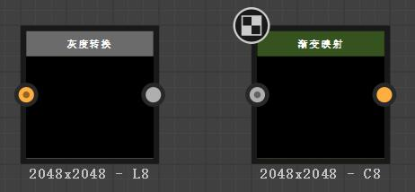

# 快捷键操作
|按键|作用
|:-|:-
|<kbd>Ctrl</kbd>|可以多选节点或者连接线
|<kbd>Backspace</kbd>|删除节点但是不断开连接线
|<kbd>Alt</kbd>|在链接上增加拐点

# 链接/导入
使用方法：资源管理器 -> 文件名称.sbs（右键）-> 链接/导入
+ 链接会关联本地文件当你本地图片或者模型做出修改后会对进行一个同步，但如果你把外部的图片删除或者移动位置SD内文件就会丢失。
+ 导入相当于把图像直接导入进工程文件，当外部文件被删除的时候他也还会在SD文件中。

# 节点

| 
|:-:|:-:
|橙色代表颜色数据|灰色代表非颜色数据

如果颜色数据不匹配线会变成红色，他们之间是不能随便连接的所以就需要用到两个转换的节点

灰度转换 和 渐变映射
+ 灰度转换：把颜色转换为灰度
+ 渐变映射：把灰度转换为颜色

## 管理节点

选择需要的节点右键可以添加注释和取景框
+ 取景框：用来给节点进行分类
+ 注释：用于描述节点

