# 
C# 脚本

## 动态修改物体属性物体类的使用
~~~cs
// 获取当前脚本所挂载的游戏物体
GameObject go = this.gameObject;
Debug.Log(go.name);
// 更简单的获取方式
Debug.Log(gameObject.name);

// 打印标签
Debug.Log(gameObject.tag);

// 打印图层
Debug.Log(gameObject.layer);

// 打印立方体名称
Debug.Log(Cube.name);

// 激活状态
Debug.Log(Cube.activeInHierarchy); // 当前真正的激活状态
Debug.Log(Cube.activeSelf);        // 自生激活状态

// 获取Transform组件
Debug.Log(transform.position);

// 获取其他组件
BoxCollider bc = GetComponent<BoxCollider>();
gameObject.AddComponent<AudioSource>(); // 给自身“Empty”添加组件
Cube.AddComponent<AudioSource>();       // 给“Cube”添加组件

// 通过游戏物体的名称获取游戏物体
GameObject test1 = GameObject.Find("Test");
Debug.Log(test1.name);

// 通过标签名称获取游戏物体
GameObject test2 = GameObject.FindWithTag("Enemy");
Debug.Log(test2.name);
// 设置激活状态
test2.SetActive(false);

// 通过预设体来实列化一个游戏物体
// Instantiate(Prefab);
// Instantiate(Prefab, transform);
GameObject go2 = Instantiate(Prefab, Vector3.zero,  Quaternion.identity); // 把Prefab放到世界原点，不旋转(四元数)
// 销毁 
Destroy(go2);
~~~

## 场景
~~~cs
// 两个类，场景类，场景管理类
// SceneManager.LoadScene("Learn1");

// 获取当前场景
Scene scene = SceneManager.GetActiveScene();
Debug.Log(scene.name);

// 场景是否已经加载
Debug.Log(scene.isLoaded);

// 场景路径
Debug.Log(scene.path);

// 场景索引
Debug.Log(scene.buildIndex);

// 获取场景下所有的子物体
GameObject[] gos = scene.GetRootGameObjects();
Debug.Log(gos.Length);

/* 场景管理类 */
// 创建新的场景
Scene newScene = SceneManager.CreateScene("newScene");

// 当前以加载的场景数量
Debug.Log(SceneManager.sceneCount);

// 卸载场景（销毁）
SceneManager.UnloadSceneAsync(newScene);

// 加载场景（替换当前场景）
// SceneManager.LoadScene("Learn1", LoadSceneMode.Single);

// 加载场景（添加到当前场景）
SceneManager.LoadScene("Learn1", LoadSceneMode.Additive);
~~~

## 位置旋转缩放

获取位置缩放旋转
~~~ cs
Debug.Log(transform.position); // 全局坐标
Debug.Log(transform.localPosition); // 相对坐标

// 获取旋转
Debug.Log(transform.rotation);
Debug.Log(transform.localRotation);
Debug.Log(transform.eulerAngles);
Debug.Log(transform.localEulerAngles);

// 获取缩放
Debug.Log(transform.localScale);

// 向量（物体的方向）
Debug.Log(transform.forward);
Debug.Log(transform.right);
Debug.Log(transform.up);
~~~

变换

~~~cs
// 时时刻刻看向世界中心点 (0, 0, 0)
transform.LookAt(Vector3.zero);

// 每帧率旋转1°
transform.Rotate(Vector3.up, 1);

// 绕某个物体旋转
transform.RotateAround(Vector3.zero, Vector3.up, 1);
~~~

父子关系
~~~cs
// 获取父物体
// transform.parent.gameObject

// 子物体个数
Debug.Log(transform.childCount);

// 解除与子物体的父子关系
transform.DetachChildren();

// 获取子物体
Transform trans = transform.Find("Child");
transform.GetChild(0);

// 判断一个物体是不是另一个物体的子物体
bool res = trans.IsChildOf(transform);
Debug.Log(res);

// 设置父物体
trans.SetParent(transform);
~~~

## 按键输入检测
~~~cs
// 鼠标输入 0左键 1右键 2滚轮
if (Input.GetMouseButtonDown(0))
{
    Debug.Log("按下了鼠标左键");
}

if (Input.GetMouseButton(0))
{
    Debug.Log("长按鼠标左键");
}

if(Input.GetMouseButtonUp(0))
{
    Debug.Log("抬起了鼠标左键");
}

// 键盘输入（枚举）
if (Input.GetKeyDown(KeyCode.A))
{
    Debug.Log("按下了A");
}
if (Input.GetKey(KeyCode.A))
{
    Debug.Log("长按A");
}
if (Input.GetKeyUp(KeyCode.A))
{
    Debug.Log("松开了A");
}

if (Input.GetKeyDown(KeyCode.A))
{
    Debug.Log("按下了A");
}
// 键盘输入（字符）可以使用小写不能使用大写
if (Input.GetKeyDown("b"))
{
    Debug.Log("按下了B");
} 

~~~

## 虚拟轴
那么虚拟轴到底是什么?简单来说，虚拟轴就是一-个数值在-1~ 1内的数轴，这个数轴上重要的数值就是-1.0和1。
当使用按键模拟一个完整的虚拟轴时需要用到两个按键,即将按键1设置为负轴按键,按键2设置为正轴按键。在没有按下任何按键的时候，虚拟轴的数值为0;在按下按键1的时候，虚拟轴的数值会从0~-1进行过渡;在按下按键2的时候，虚拟轴的数值会从0~ 1进行过渡

    按键1           没按键          按键2
    |_______________|_______________|
    -1              0               1

`项目设置` → `输入管理` → `轴线` 可以查看虚拟轴设置

获取虚拟轴
~~~cs
float horizontal = Input.GetAxis("Horizontal");
float vertical = Input.GetAxis("Vertical");
Debug.Log(horizontal + "   " + vertical);
~~~

获取虚拟按键
~~~cs
if(Input.GetButtonDown("Jump"))
{
    Debug.Log("空格");
}
~~~

## 音乐音效
再添加音效c#代码前先给物体增加一个 `Audio Source` 组件才能让物体正常播放音频

代码中 `music1` 为音乐 `music2` 为音效
~~~cs
public class AudioTest : MonoBehaviour
{
    public AudioClip music1;
    public AudioClip music2;

    // 播放器组件
    private AudioSource player;

    void Start()
    {
        player = GetComponent<AudioSource>();
        // 设定播放的音频片段
        player.clip = music1;
        // 循环
        player.loop = true;
        // 音量
        player.volume = 0.5f;
        // 播放
        player.Play();
    }

    // Update is called once per frame
    void Update()
    {
        if (Input.GetKeyDown(KeyCode.Space))
        {
            // 如果当前正在播放
            if (player.isPlaying)
            {
                // 暂停播放
                player.Pause();

                // 停止播放
                // player.Stop();
            }
            else
            {
                // 暂停
                player.UnPause();

                // 开始播放
                // player.Play();
            }
        }

        // 按鼠标左键播放声音
        if (Input.GetMouseButtonDown(0))
        {
            // 播放音效
            player.PlayOneShot(music2);
        }
    }
}
~~~

## 角色控制初步实现

在添加C#脚本之前先给我们的角色创建一个Character Controller的组件

~~~cs
private CharacterController player;

void Start()
{
    player = GetComponent<CharacterController>();
}

void Update()
{
    // 水平
    float horizontal = Input.GetAxis("Horizontal");
    // 垂直
    float vertical = Input.GetAxis("Vertical");
    // 创建成一个方向向量
    Vector3 dir = new Vector3(horizontal, 0, vertical);
    // Debug.DrawRay(transform.position, dir, Color.red);
    // 朝向该方向移动（受重力影响）
    player.SimpleMove(dir * 2);
}
~~~

## 火球物理和爆炸
1. 先从unity资源商店中下载名为 `Procedural fire` 的火焰资源包
2. 随便挑选一个火焰的预制体然后在上面挂上名为 `FireTest` 的脚本
3. 在 `Explosion` 预制体上挂一个名为`ExplosionTest`的脚本，用于编写爆炸效果销毁的功能

FireTest.cs
~~~cs
// 创建一个爆炸的预设体
public GameObject Perfab;

// 监听发生碰撞
private void OnCollisionEnter(Collision other) 
{
    // 创建一个爆炸物体 (爆炸物体, 生成位置，旋转)
    Instantiate(Perfab, transform.position, Quaternion.identity);
    // 销毁自身
    Destroy(gameObject);

    // 获取碰撞到的物体并打印
    Debug.Log(other.gameObject.name);
}

// 持续碰撞中
private void OnCollisionStay(Collision other) 
{
}

// 结束碰撞
private void OnCollisionExit(Collision other) 
{
}
~~~

ExplosionTest.cs
~~~cs
float timer = 0;

void Update()
{
    timer += Time.deltaTime;
    if (timer > 1)
    {
        Destroy(gameObject); // 销毁爆炸
    }
}
~~~

## 触发器

~~~cs
// 监听触发
private void OnTriggerEnter(Collider other) {
    GameObject door = GameObject.Find("door");
    if (door != null) 
    {
        door.SetActive(false);
    }
}

// 持续触发
private void OnTriggerStay(Collider other) 
{
}

// 触发结束
private void OnTriggerExit(Collider other) 
{
}
~~~

## 铰链、弹簧
Hinge Joint（铰链组件）：非常适合制作门，但也可用于制作链条、摆锤等模型。 

Spring Joint （弹簧组件）：但允许它们之间的距离发生变化，就好像它们被弹簧连接一样。 

## 物理材质
物理材质 (Physic Material) 用于调整碰撞对象的摩擦力和反弹效果。

要创建物理材质，请从菜单栏中选择 Assets > Create > Physic Material。

然后物理材质可以拖拽到相应的碰撞器中（Collider）

## 射线

~~~cs
void Update()
{
    if (Input.GetMouseButtonDown(0))
    {
        // 射线
        Ray ray = Camera.main.ScreenPointToRay(Input.mousePosition);
        // 声明一个碰撞信息类
        RaycastHit hit;
        // 检测碰撞
        bool res = Physics.Raycast(ray, out hit);
        // 如果碰撞到的情况下，hit就有内容了
        if (res == true)
        {
            Debug.Log(hit.point);
            transform.position = hit.point;
        }

        // 多检测 (射线, 最大距离, 只检测第十个图层)
        // RaycastHit[] hits = Physics.RaycastAll(ray, 100, 1<<10);
    }        
}
~~~

## 粒子
暂无记录

## 线段（Line Renderer）and（Trail Renderer）
Trail Renderer（拖尾）  
使用此模块可将轨迹添加到一部分粒子。此模块与轨迹渲染器 (Trail Renderer) 组件共享许多属性，但提供了将轨迹轻松附加到粒子以及从粒子继承各种属性的功能。轨迹可用于各种效果，例如子弹、烟雾和魔法视觉效果。

## 动画组件
### Animation Clip（旧版动画组件）
Animations：可以 `窗口` > `动画` 中打开动画窗口新建的动画会被自动添加进 `Animations` 中。

我制作了一个 `cube` 左右移动的动画分别命名为 `right` 和 `left`可以看到Animation组件上可以挂在多个动画

选中我们保存好的动画文件可以设置动画的拼接模式

接下来我们用 c# 脚本控制`Right`动画的播放
~~~cs
void Update()
{
    if (Input.GetMouseButtonDown(0))
    {
        GetComponent<Animation>().Play("right");
    }
}
~~~

### Animator（新版动画组件）
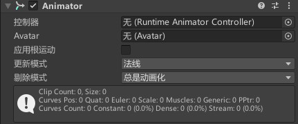

Animations 参数消失了，取而代之的是一个名为`控制器`的选项；我们可以在项目资源管理器中创建`动画控制器`

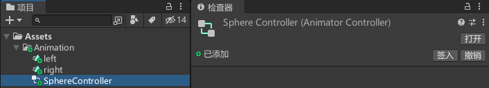

双击这个文件可以打开动画器面板

接下来我们到我们熟悉的动画面板 可以使用<kbd>Ctlr</kbd> + <kbd>6</kbd>可以快速打开，新建一个动画后双击点开后发现和旧版的有些差别。

我们可以右键创建动画的过渡或者设置为图层默认状态（默认播放动画）

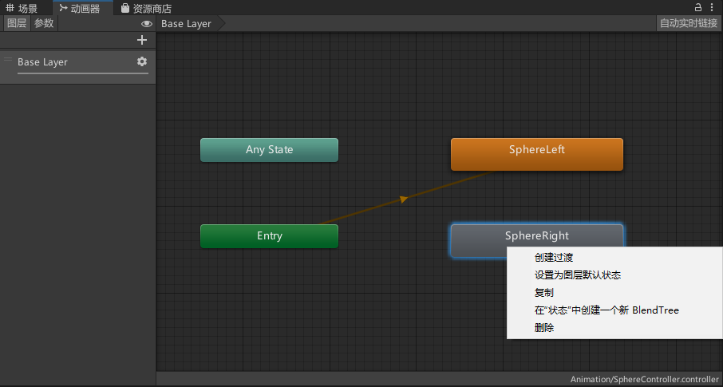

### 制作人物动画1（拾取）

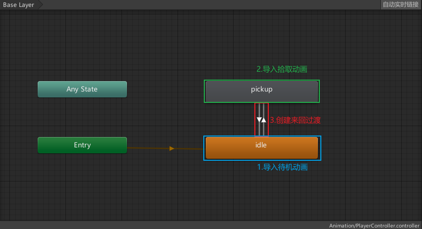

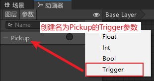

播放动画发现`idle`必须要播放完才会播放`pickup`这并不是我们想要的效果，想要他即时触发就需要点击过渡的那条线，会出来详细设置其中有一条就是`有退出时间`这个选项给去掉。

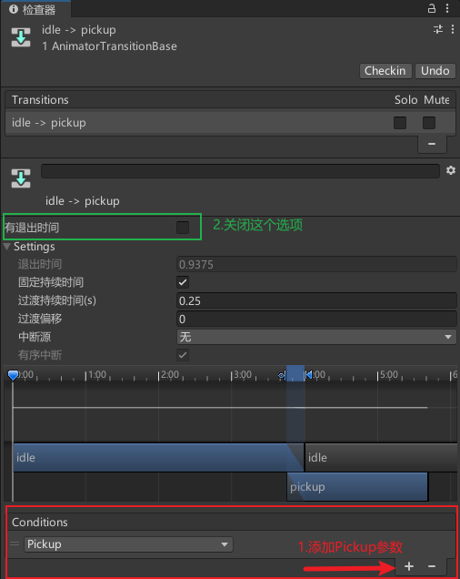

接下来我们需要使用 c#脚本来控制Pickup这个参数的开关，当键盘按下F就播放拾取动画。

~~~cs
void Update()
{
    if (Input.GetKeyDown(KeyCode.F))
    {
        GetComponent<Animator>().SetTrigger("Pickup");
    }
}
~~~

### 制作人物动画2（跑步）

~~~cs
public class PlayerControl3 : MonoBehaviour
{
    private Animator animator;
    void Start()
    {
        animator = GetComponent<Animator>();
    }

    void Update()
    {
        // 水平轴
        float horizontal = Input.GetAxis("Horizontal");
        // 垂直轴
        float vertical = Input.GetAxis("Vertical");
        // 向量
        Vector3 dir = new Vector3(horizontal, 0, vertical);

        // 当用户按下了方向键
        if (dir != Vector3.zero)
        {
            // 面向向量
            transform.rotation = Quaternion.LookRotation(dir);
            // 播放跑步动画
            animator.SetBool("IsRun", true);
            // 朝向前方移动
            transform.Translate(Vector3.forward * 2 * Time.deltaTime);
        }
        else
        {
            animator.SetBool("IsRun", false);
        }
    }
}
~~~

### 动画导入设置

 | 

#### 人形 (Avatar)
如果骨架为人形（有两条腿、两条手臂和一个头），请使用人形动画系统。Unity 通常会检测骨架并将其正确映射到 Avatar。有些情况下，可能需要更改 Avatar 定义 (Avatar Definition) 并手动对映射进行__配置 (Configure)__。

#### 泛型 (Generic)
如果骨架为非人形（四足动物或任何要动画化的实体），请使用通用动画系统。Unity 会选择一个根节点，但可以确定另一个用作__根节点__的骨骼。

#### 旧版 (Legacy)
使用旧版动画系统。与 Unity 3.x 及更早版本一样导入和使用动画。

#### 无 (None)
不存在动画

### 动画裁剪

新建的动画剪辑在项目资源管理器中展开fbx模型文件就能看的到（`run2`）。

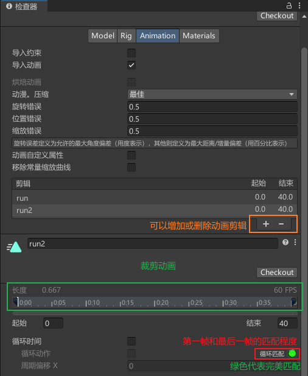 | 
:-: | :-:
Animator-11 | Animator-12

### 曲线

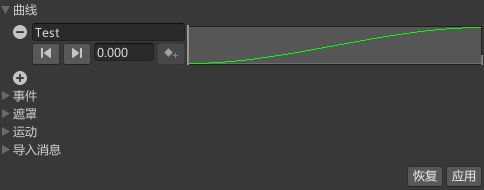 | 
:-: | :-:
Animator-13 | Animator-14

~~~cs
// 获取Test参数并打印出来
Debug.Log(animator.GetFloat("Test"));
~~~

### 事件

 | 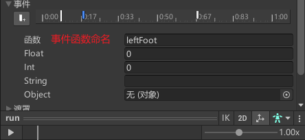
:-: | :-:
Animator-15 | Animator-16

创建好后在c#脚本中写入同名函数就能进行调用

~~~cs
void leftFoot()
{
    Debug.Log("左脚");
}

void rightFoot()
{
    Debug.Log("右脚");
}
~~~

### 混合树

通过下方图片中的操作可以创建新的混合树，然后我们可以双击进入混合树的层级;

 | 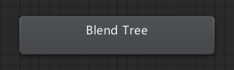
:-: | :-:
Animator-17 | Animator-18

我们暂时先用默认的1D混合类型，关闭`Automate Thresholds`选项可以手动分配Thresholds的值。

在混合树中还能新建嵌套的混合树，和其他混合树一样双击点进去就能有详细设置。

### 动画层

默认有三个状态 Entry，Any State，Exit 详细可以看下图解释，Exit后面点再解释。

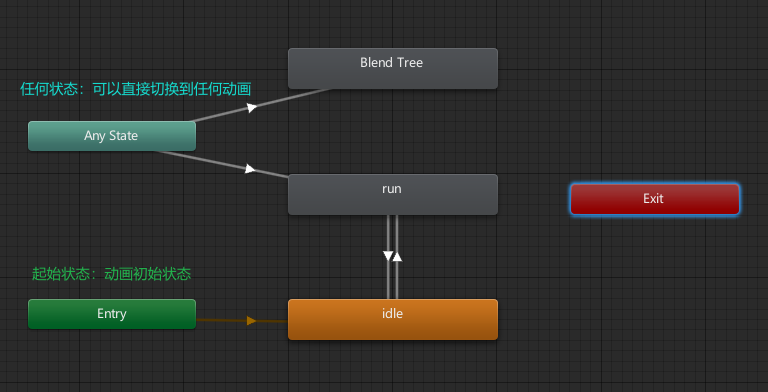

#### 子状态机

右键面板可以创建一个新的子状态机，除了之前就介绍到的Entry，Any State，Exit还多出一个 Base Layer，他的作用和Exit 相同都是返回上一层状态。

角色通常具有包含若干阶段的复杂动作。合理的做法是识别单独阶段并将单独状态用于每个阶段，而不是用单个状态来处理整个动作。例如，角色可能会有一个名为“Trickshot”（花式射击）的动作；在此动作中，角色会蹲下来稳定瞄准，射击，然后再站起来。

 | 
:-: | :-:
Animator-22 | Animator-23

#### 图层
Unity 使用`动画层`来管理不同身体部位的复杂状态机，让身体不同的部位播放不同的动画。相应的示例为，您有一个用于行走/跳跃的下身层，还有一个用于投掷物体/射击的上身层。

我们可以在项目中右键新建一个 `Avatar 遮罩`

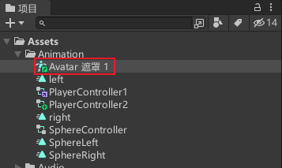  | 
:-: | :-:
Animator-25 | Animator-23

接下来我们就能把新建的`Avatar 遮罩`给我们第二个图层。  
权重的值越高图层的动画效果越强，强度0.5 相当于`图层1`和`图层2`各混合一半，强度1就相当于遮罩绿色部分完全播放`图层2`的动画。

### ik

使用反向动力学（IK）让角色的头部或手臂看向或指向场景中的球体。

想要启用IK我们需要打开 `动画器` → `图层` → `IK处理` 的这个选项。

之后在人物脚本上增加如下代码。

~~~cs
public Transform target;

private void OnAnimatorIK(int layerIndex) 
{
    // 设置头部IK权重
    animator.SetLookAtWeight(1);
    // 头部旋转
    animator.SetLookAtPosition(target.position);

    // 设置右手IK权重
    animator.SetIKPositionWeight(AvatarIKGoal.RightHand, 1);
    animator.SetIKRotationWeight(AvatarIKGoal.RightHand, 1);
    // 设置右手IK
    animator.SetIKPosition(AvatarIKGoal.RightHand, target.position);
    animator.SetIKRotation(AvatarIKGoal.RightHand, target.rotation);
}
~~~

## 导航寻路

### 导航网格 

导航网格（即 Navigation Mesh，缩写为 NavMesh）是一种数据结构，用于描述游戏世界的可行走表面，并允许在游戏世界中寻找从一个可行走位置到另一个可行走位置的路径。该数据结构是从关卡几何体自动构建或烘焙的。

我们可以这么理解：它是unity官方自带的一种寻路系统。我们可以通过它来制作简单的寻路，比如可以制作点击某个位置，让角色自动的绕开障碍走到目标点的效果，比如可以制作敌人AI，让它可以通过NavMesh绕开障碍追击我方单位。甚至可以在NavMesh中设置传送门，跳跃的起点落点，让这些效果也参与寻路的计算，成功计算出导航的捷径。

在烘焙导航网格之前需要把作为障碍物以及地面的物体开启 `Navigation Static` 选项。

之后在菜单栏中 `窗口` > `AI` > `导航`中的（bake）烘焙。

接下面我们要在名为`player`的一个胶囊体上挂载 `Nav Mesh Agent` 组件具体看图：`NavMeshAgent-3`。

代理类型默认为`Humanoid`，这个选项是我们可以自己新建的就在`窗口` > `AI` > `导航` > `代理`中。（具体看图`NavMeshAgent-4`）

 | 
:-: | :-:
NavMeshAgent-3 | NavMeshAgent-4

接下来我们要通过脚本来实现，通过鼠标点击位置来让胶囊体移动到指定位置。

~~~cs
using System.Collections;
using System.Collections.Generic;
using UnityEngine;
using UnityEngine.AI;

public class PlayerControl4 : MonoBehaviour
{
    private NavMeshAgent agent;

    void Start()
    {
        // 获取代理组件
        agent = GetComponent<NavMeshAgent>();
    }

    void Update()
    {
        if (Input.GetMouseButtonDown(0))
        {
            // 获取点击位置
            Ray ray = Camera.main.ScreenPointToRay(Input.mousePosition);
            RaycastHit hit;

            if (Physics.Raycast(ray, out hit))
            {
                // 点击位置
                Vector3 point = hit.point;

                // 设置该位置为导航目标点
                agent.SetDestination(point);
            }
        }
    }
}
~~~

### 导航网格障碍物 (Nav Mesh Obstacle)
导航网格障碍物 (Nav Mesh Obstacle) 组件允许您描述导航网格代理在世界中导航时应避开的移动障碍物（例如，由物理系统控制的木桶或板条箱）。当障碍物正在移动时，导航网格代理会尽力避开它。当障碍物静止时，它会在导航网格中雕刻一个孔。导航网格代理随后将改变它们的路径以绕过障碍物，或者如果障碍物导致路径被完全阻挡，则寻找其他不同路线。

### 网格外链接 (Off Mesh Link)

OffMeshLink 组件允许您合并无法使用可行走表面来表示的导航捷径。例如，跳过沟渠或围栏，或在通过门之前打开门，全都可以描述为网格外链接。

我们使用两个压扁的cube作为跳板位置，在其中一个Cube上挂载Off Mesh Link这个组件

### 导航区域

1. 首先新建一个名为Water（水）

    

2. 新建一个cube作为水的区域大小

    

3. 选中我们上面新建的cube到 `导航` > `对象` > `Navigation Area` 中选择我们在第一步新建的Water，然后再重新烘焙；

    

4. 我们运行游戏就会发现我们的胶囊体玩家就会主动绕开Water水的区域，但是如果穿越water的开销比绕路更低的时候胶囊提会毫不犹豫的穿过water区域。
 
5. 如果我们只想让玩家或者NPC或怪物在指定区域行动而避开比如water区域，只需要在玩家或者怪物的`Nav Mesh Agent`组件下的`区域遮罩`中关闭`Water`，这样不管怎么样我们的玩家或NPC就完全不会踏足这片区域了。

    

    