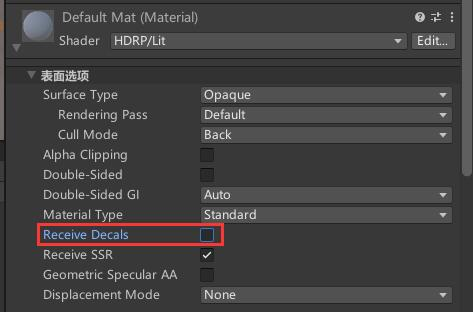

# 
渲染

---
## Volume
+ Exposure（曝光控制）

+ Visual Envronment（环境控制）

+ Fog（雾效）

+ Lighting （光照）

## 
静态光照

### 室内光
不推荐使用材质自发光，自发光每个灯光都是靠材质球的发射强度控制的，需要细微调整的时候也不是那么方便，目前建议使用在平面光去代替那些自发光的材质球进行渲染，效果调整更方便。

### 生成照明
1. 当间接光烘焙出现噪点和黑色斑块可以通过修改 **降噪器设置** 推荐使用`OpenImageDenoise` 降噪器, **间接过滤器** 设置为`Gaussian`半径设置为最大值5；
2. 推荐打开 `环境光遮蔽`，看模型大小一般最大距离 `1` 是完全够用的，直接贡献可以调整AO阴影的颜色深度，我一般推荐调淡一些 比如：`0.25`，直接贡献强度太高阴影颜色会很深显得非常不真实。

### ⚠:自发光无法烘焙
+ 如果自发光烘焙无效果需要把 `Exposure weight` 的值调为0。
+ 检查 **全局光照** 选项中是否选择的是`Realtime`，如果渲染没效果大概选择的是 `无（None）`。
+ **全局光照** 这个选项需要保证所有需要烘焙光照的网格必须开着 `Realtime` ，要不然会烘焙不上。

## 
反射探针

反射探针选择 `盒体` 在室内效果会更立体更真实

## 
屏幕空间反射

HDRP管线默认是不开启屏幕空间反射的需要手动开启，URP没有内置SSR。

在 `项目设置` → `质量` → `HDRP` 选择我们目前正在使用的配置（HDRP Hogj Fidelity），然后再选择 `光照` → `反射` 中的屏幕空间反射以及下方的透明的也都打开；这时候我们就能在 Volume 中加入屏幕空间反射

# 
材质

## 贴花
### 关闭个别材质的贴花投影
选择材质设置中的 `Receive Decals` 关闭它；
