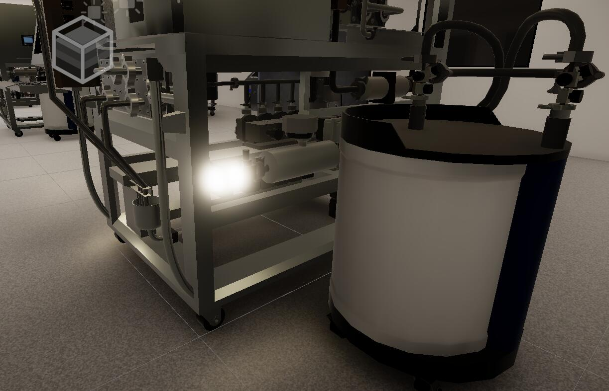
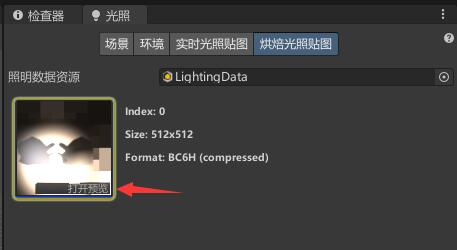
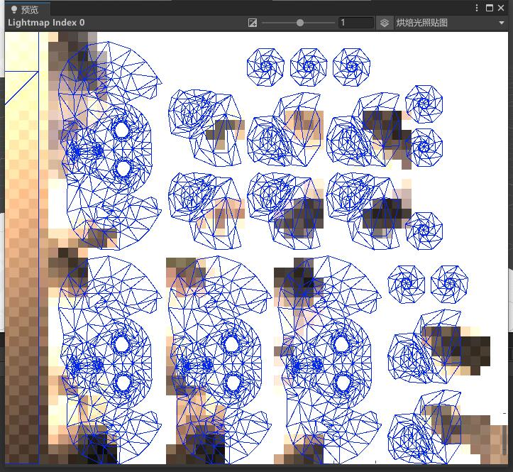
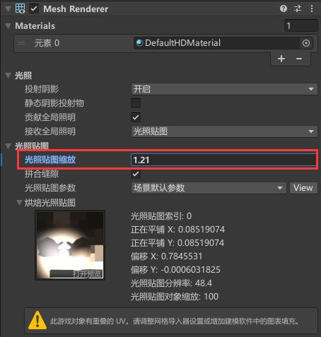

# 光照uv重叠
模型烘焙后会出现光斑或其他问题（光照贴图问题需要，这是一个暗病），随着模型的数量增加需要预烘焙的的模型数量增加这类出现光斑的情况会越来越常见。

 | 
:-:|:-:

## 查看重叠部分
我们在`场景`视图上方切换到 `uv Overlap` 就能看到红色的为重叠部分；（注：重叠显示由每次重新生成光照进行更新）

## uv准则
 先确保uv之间是留有空隙的，要保证uv不会紧挨在一起。

如果uv之间增加了空隙渲染后查看 `uv Overlap` 还有红色重叠部分那就是光照贴图不够密集

在unity的菜单栏 `窗口` → `渲染` → `光照` 中 `烘焙光照贴图` 可以看到我们当前以烘焙的贴图；

在预览窗口右上角可以切换为 `烘焙 uv 重叠` （注：重叠显示由每次重新生成光照进行更新）

 | 
:-:|:-:
光照贴图uv | 光照渲染uv像素重叠部分

## 缩放光照贴图分辨率
选中模型的网格在 `检查器` 面板把光照贴图缩放增加到合适的密度，确保重新渲染后没有红色部分。

