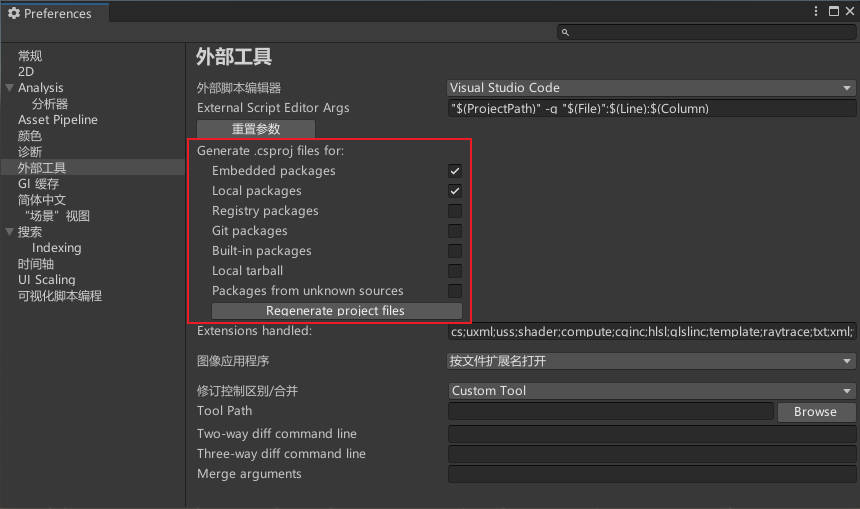

# 
Unity数据包

**ProBuilder**
>在Unity中构建、编辑和纹理自定义几何体。使用ProBuilder进行场景级设计、原型制作、碰撞网格。
高级功能包括UV编辑、顶点颜色、参数化形状和纹理混合。使用ProBuilder的模型导出功能，可以轻松调整任何外部三维建模套件中的级别。

# 
环境上的一些问题

## unity c# 在vscode下没有代码补全
如果以及把.net重装或者一系列方法尝试过后还是不行那么可以查看下图部分比如尝试点击 `Reqenerate project files` （重新生成项目文件）

