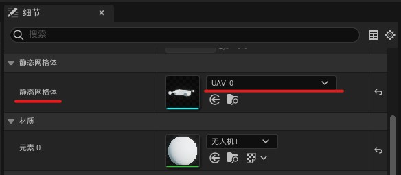
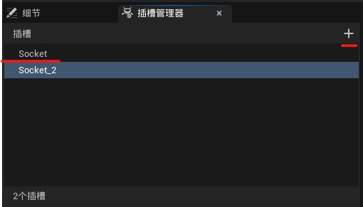

# <center>Unreal C++ API 笔记</center>

## TSubclassOf
**TSubclassOf** 是提供 UClass 类型安全性的模板类。例如您在创建一个投射物类，允许设计者指定伤害类型。您可只创建一个 UClass 类型的 UPROPERTY，让设计者指定派生自 UDamageType 的类；或者您可使用 TSubclassOf 模板强制要求此选择。以下示例代码展示了不同之处：

``` cpp
/** type of damage */
UPROPERTY(EditDefaultsOnly, Category=Damage)
UClass* DamageType;
```
vs  
``` cpp
/** type of damage */
UPROPERTY(EditDefaultsOnly, Category=Damage)
TSubclassOf<UDamageType> DamageType;
```


---
Unreal 日志宏；Log为正常日志，在控制台输出为白色字体；Warning是警告在控制台输出黄色字体；Error为错误，在控制台输出红色字体。
~~~ cpp
UE_LOG(LogTemp, Log, TEXT("hello world"));
UE_LOG(LogTemp, Warning, TEXT("hello world"));
UE_LOG(LogTemp, Error, TEXT("hello world"));
~~~

# c++ 无人机案例

1. 新建一个c++类，选择 `Pawn`，命名为 `Drone`。  
`UPROPERTY(VisibleAnywhere)` 中的 `VisibleAnywhere（随处可见）` 代表在蓝图编辑的细节面板和实列化到3D场景中的细节面板可见。  
除了 `VisibleAnywhere` 还有 `EditAnywhere` `EditDefaultsOnly` 分别是可在3D视图和蓝图面板任意编辑 和 只能在蓝图细节面板编辑，这两个参数和`VisibleAnywhere`不是同一种类型；`VisibleAnywhere`和它们两个主要区别就是`VisibleAnywhere`蓝图细节面板和Map中实列化后的细节面板参数是关联的，而使用`EditAnywhere`蓝图和Map就被单独分开了，参数互不干扰，`EditDefaultsOnly` 就是统一在蓝图中设置。
~~~ cpp
// Drone.h
ADrone();
// 在ADrone();这个重载函数下写如下↓
UPROPERTY(VisibleAnywhere) // 注意在UPROPERTY()这个宏后是不写;的
// 一个前向声明
class UStaticMeshComponent* Mesh;
~~~
`CreateDefaultSubobject` 该函数是个模板函数，用于创建组件或子对象，然后返回指向新建组件内存区域的指针。
+ 此函数只能在无参构造器中使用而不能在BeginPlay等函数中使用！
+ 参数中的TEXT或者FName参数在同一个Actor中不能重复
~~~ cpp
// Drone.cpp
ADrone::ADrone()
{
    PrimaryActorTick.bCanEverTick = true;
    // 需要引入 #include "Components/StaticMeshComponent.h"；UE5好像不引入也能编译
    // 实例化一个网格体
    Mesh = CreateDefaultSubobject<UStaticMeshComponent>(TEXT("MeshObject"));
}
~~~
+ ↓ 其他列子如：经常用到的实力化一个摄像机弹簧臂组件和摄像机组件，并且摄像机组件附加到弹簧臂上:（这部分内容可忽略不在案例内）
~~~ cpp
// 注意引用头文件：#include "GameFramework/SpringArmComponent.h"
SpringArm = CreateDefaultSubobject<USpringArmComponent>(TEXT("SpringArm"));

// 注意引用头文件：#include "Components/StaticMeshComponent.h"
Camera = CreateDefaultSubobject<UCameraComponent>(TEXT("Camera"));
Camera->SetupAttachment(SpringArm);
~~~

2. 导入无人机模型（我在blender建模了一个简易无人机），通过glb格式导入进虚幻引擎；

	
	
3. 把我们之前写的`Drone`c++类新建成蓝图类，在左侧的组件面板选中我们写的网格实列`Mesh(MeshObject)` 然后在右侧的细节面板就能看到静态网格体选择

	 | 
	:---: | :---:
	组件 | 细节

4. 从`内容浏览器` 双击打开无人机主体（UAV_0）模型，找到右侧的插槽管理器，右上角的加号能增加插槽，然后我们就可以在3d视图中移动我们刚刚新建好的插槽；按住alt + 移动插槽 可以顺便复制插槽；最后给他们分别命名为 `Paddle1` `Paddle2` `Paddle3` `Paddle4`。

	

5. 在 `Drone.h` 文件中声明我们的 Paddle1234 的静态网格组件，添加方式和我们之前Mesh的写法一样

~~~ cpp
UPROPERTY(VisibleAnywhere)
class UStaticMeshComponent* Paddle1;

UPROPERTY(VisibleAnywhere)
class UStaticMeshComponent* Paddle2;

UPROPERTY(VisibleAnywhere)
class UStaticMeshComponent* Paddle3;

UPROPERTY(VisibleAnywhere)
class UStaticMeshComponent* Paddle4;
~~~

在 `Drone.cpp` 文件的构造函数中实现我们的在 `Drone.h` 文件中前向声明的几个静态网格组件；实现后就需要对他使用`SetupAttachment`进行初始化；这个函数中第一个参数SetupAttachment填我们要设置的父级（`Mesh`），第二参数是可选的名为SocketName指的是我们前面创建的`插槽`；

~~~ cpp
ADrone::ADrone()

{
    PrimaryActorTick.bCanEverTick = true;

    // 将Mesh设置为RootComponent的根组件
    RootComponent = Mesh;

    // 实例化网格体
    Mesh = CreateDefaultSubobject<UStaticMeshComponent>(TEXT("MainMesh"));
    Paddle1 = CreateDefaultSubobject<UStaticMeshComponent>(TEXT("Mesh"));
    Paddle2 = CreateDefaultSubobject<UStaticMeshComponent>(TEXT("Mesh"));
    Paddle3 = CreateDefaultSubobject<UStaticMeshComponent>(TEXT("Mesh"));
    Paddle4 = CreateDefaultSubobject<UStaticMeshComponent>(TEXT("Mesh"));

    // 初始化Paddle将他们绑定到Mesh的子级，并绑定插槽；
    Paddle1->SetupAttachment(Mesh, TEXT("paddle1"));
    Paddle2->SetupAttachment(Mesh, TEXT("paddle2"));
    Paddle3->SetupAttachment(Mesh, TEXT("paddle3"));
    Paddle4->SetupAttachment(Mesh, TEXT("paddle4"));

}
~~~
 注意除了`SetupAttachment`还有个和他很像的函数→`AttachToComponent`，但是他并不能用在构造函数中，只有`SetupAttachment`才能在构造函数中使用。