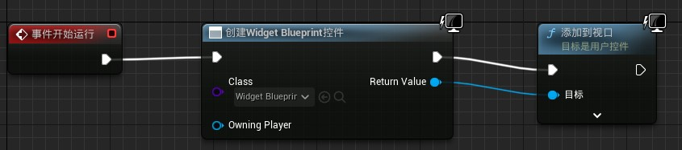

# 
Unreal Engine UI

UE5默认并不会创建画布面板需要自己手动创建：`空件板` → `面板` → `画布面板`

## 
通用参数

+ 锚点：是用来设置UI控件的位置的。锚点支持根据不同屏幕尺寸和宽高比进行设置
+ 位置XY：设置位置
+ 尺寸XY：设置尺寸
+ 对齐XY：（None）
+ 大小到内容：将空间大小设置为实际内容大小
+ ZOrder：相当于渲染优先级或层级

## 
将UI渲染到游戏窗口

打开关卡蓝图在 `事件开始运行` 后创建 `窗口控件`，在class选项选择我们之前创建的蓝图控件类；在连接到 `添加到视口`；

