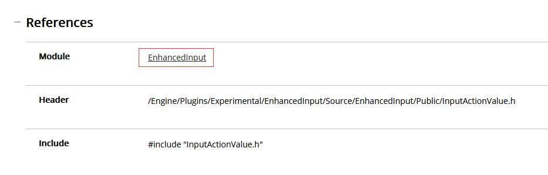

# 
错误

# 虚幻引擎中基于C++类创建的蓝图类修改代码编译后不更新
如果您在虚幻引擎中使用C++类创建了蓝图类，但是在修改代码并编译后，发现蓝图类并没有更新，可能是因为缓存问题导致的。下面是一些可能有用的解决方案。

## 1. 清除Intermediate和Saved文件夹

在虚幻引擎项目的根目录中，有一个名为“Intermediate”的文件夹和一个名为“Saved”的文件夹。这些文件夹中存储了编译后的、生成的和缓存的文件。尝试删除这些文件夹中的所有内容，然后重新编译您的代码。

## 2. 重新启动虚幻引擎编辑器

有时候，虚幻引擎编辑器可能会缓存某些数据，包括编译后的代码。尝试重新启动编辑器，然后重新编译您的代码。

## 3. 禁用蓝图类的“蓝图检查”

在蓝图类的“蓝图检查”选项中，有一个名为“自动重编译”的选项。尝试将该选项禁用，然后重新编译您的代码。

## 4. 编辑蓝图类并保存

尝试打开您的蓝图类，在其中进行一些编辑（例如改变位置），然后保存该蓝图类。这将会触发虚幻引擎重新编译该蓝图类，从而更新您的代码。

希望这些解决方案能够帮助您解决问题！

## include头文件错误
假如当你想使用`FInputActionValue`引入比如 “增强输入模块” 但是无法找到头文件这类问题

~~~cpp
// MyCharacter.h
#include "InputActionValue.h"
~~~

1. 你需要在 `项目名称.Build.cs`这个c#文件中添加模块，模块名称一般官方API手册中都有写比如

~~~cs
// 项目名称.Build.cs

// 在这行添加模块
PublicDependencyModuleNames.AddRange(new string[] { "Core", "CoreUObject", "Engine", "InputCore", "EnhancedInput" });
~~~

2. 您需要做的不仅仅是重新生成 VS 项目文件。 关闭虚幻编辑器和 Visual Studio。 打开您的项目目录并删除所有这些文件夹 - .vs、Binaries、Intermediate、Saved [可选]，以及 YourGame.sln 文件。 确保 Config 文件夹在那里……

## 正常编译但是 VisualStudio 一直报错

双击错误的内容会发现给我们跳转到虚幻引擎的一些库中代码并不是属于项目中的脚本文件，即使正常编译VS也还是会给出错误提示。解决方法也很简单，只需要把（错误列表）上方的（生成+IntellSense）改为（仅生成）就可以。

（IntellSense）其实就是智能提示，是由VS推算出来的错误和实际编译是有一些差别的，我们不需要看这部分所以直接忽略就好。

# 
一些解释

笔记中很多内容解答可能来源于搜索引擎或者AI，我会尽可能删除不需要的部分以及不正确的部分。

## 虚幻引擎中GetActorUpVector的作用
在虚幻引擎中，GetActorUpVector是一个函数，可以用来获取一个Actor对象的向上的向量。这个函数可以返回一个三维向量，表示Actor对象的朝向。

在虚幻引擎中，Actor是代表场景中可以交互的任何物体的基本单元。这些物体可以是角色、道具或环境物体等等。GetActorUpVector函数可以帮助开发者确定Actor对象的朝向，从而使得其他的操作更加精准。

例如，当一个角色需要跳跃到一个平台的时候，我们需要知道这个平台的朝向，以便角色能够正确地跳跃到平台上。使用GetActorUpVector函数可以帮助我们获取平台的向上的向量，从而确定平台的朝向，让角色能够正确地跳跃到平台上。

总之，GetActorUpVector函数在虚幻引擎中是一个非常有用的函数，它可以帮助开发者更好地控制Actor对象的朝向，从而使得游戏的操作更加精准。

## FVector
FVector是虚幻引擎中的一个结构体，用于表示三维向量。它包含三个浮点数，分别表示X、Y、Z三个轴向量的大小。在虚幻引擎中，FVector经常用于表示位置、方向和缩放等信息。