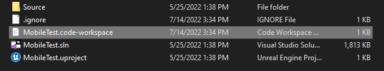

# 配置 VScode
**unreal vscode官方文档： https://docs.unrealengine.com/5.1/zh-CN/setting-up-visual-studio-code-for-unreal-engine/**

1. 如果你是在Mac或Linux上调试，请下载并安装[LLDB扩展](https://marketplace.visualstudio.com/items?itemName=vadimcn.vscode-lldb)。
2. 如果你需要将VS Code设置为默认IDE，请打开 **虚幻编辑器（Unreal Editor）** 并转至 **编辑（Edit）** > **编辑器偏好设置（Editor Preferences）** > **通用（General）** > **源代码（Source Code）** ，然后将你的 **源代码编辑器（Source Code Editor）** 设置为 **Visual Studio Code** 。重启编辑器，使更改生效。这不是生成VS Code解决方案（参阅步骤5c）所必需的，但它会成为默认值，取代Visual Studio。

3. 生成你的VS Code工作区。（两种做法）
	+ 打开 **虚幻编辑器（Unreal Editor）** 并点击 **工具（Tools）** > **刷新Visual Studio Code项目（Refresh Visual Studio Code Project）** 。
			
	+ 在Windows和Mac上，右键点击项目的 `.uproject` 文件并点击 **生成项目文件（Generate Project Files）** 。完成后，你应该会在项目的文件夹中看到 `.code-workspace` 文件。
			

## ❌vscode c/c++扩展 找不到头文件问题
我个人使用的编辑器是 vscode 编辑器， unreal vscode官方文档有给出具体的配置方案，但是有些问题文档中并没有说，比如新建的c++类会提示找不到头文件这类问题导致没法使用代码提示，官方给的解决方案是在`.vscode/c_cpp_properties.json`这个文件中加入`includePath`这个参数用来包含头文件，但是我试了这个方便并行不通（可能是我对json不够了解）；所以我找到了另一种解决方法，直接在资源管理器中右键点击项目的 `.uproject` 文件并点击 **生成项目文件（Generate Project Files）** 后就能搜索的到类的头文件了。

## ❌基于c++类的蓝图类不更新问题
编写代码的时候经常需要和蓝图交互，但是明明已经编译好了，蓝图里的内容却不更新，或者某个组件细节面板一片空白，请到工程文件目录下删除 `Binaries` 文件夹并重新生成。
### ❌基于c++类的蓝图类重新编译后显示不正确
显示不正确如：当你写了个碰撞盒大小xyz为`FVector(100.0f, 100.0f, 100.0f)`，但是你编译好后发现这不是你要的尺寸你要把xyz改成 `FVector(50.0f, 50.0f, 50.0f)` 但是你重新生成后发现蓝图类的视口中同时渲染了100.0f和50.0f大小的两个框，出现这类问题的时候你就能右键蓝图类 `资产操作` → `重新加载`

## 编译参考
在vscode中如果不想编译重启 虚幻编辑器就使用，按下快捷键 Ctrl Shift B 选择  `项目名称 Editor Win64 Development Rebulid` 或 `项目名称 Editor Win64 Development build` 

编译配置-状态 | 描述
:--- | :---
**Debug** （调试）| 该配置在调试模式中同时编译引擎和游戏代码。
**DebugGame** （调试游戏）|该配置按最优方式编译引擎，但游戏代码可被调试。此配置对于仅使用调试的游戏模块是非常有用的。
**Development** (开发）| 该配置等同于发布。引擎和游戏代码都将在此配置中被编译。
**Shipping** （发行)|该配置在设置后可达到最佳性能并能发行您的游戏。此配置剥离了控制台命令行，统计数据和分析工具。
**Test** (测试）|**Test** (测试）

编译配置-对象 | 描述
:--- | :---
[empty] （空白）|该配置编译了您项目的一个独立可执行版本，但需要平台特定的已烘焙内容。
**Editor** （编辑器）|为能在虚幻编辑器内打开项目并查看所有变更的代码，该项目必须在 **Editor** （编辑器）配置内进行编译。
**Client** (客户端） | 如存在 `<Game>Client.Target.cs` 文件，则 **Client** （客户端）编译配置将可用。
**Server** (服务器）| 如存在 `<Game>Server.Target.cs` 文件，则 **Server** （服务器）编译配置将可用。