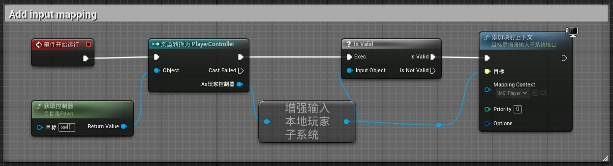
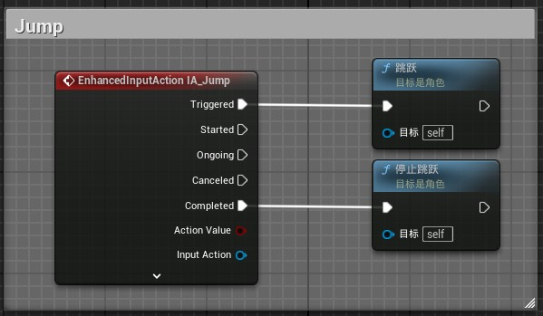
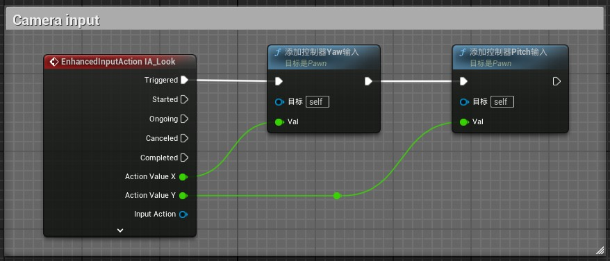
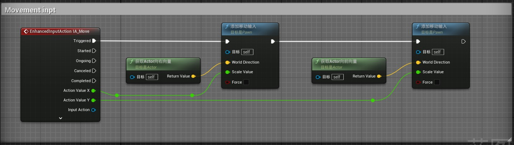
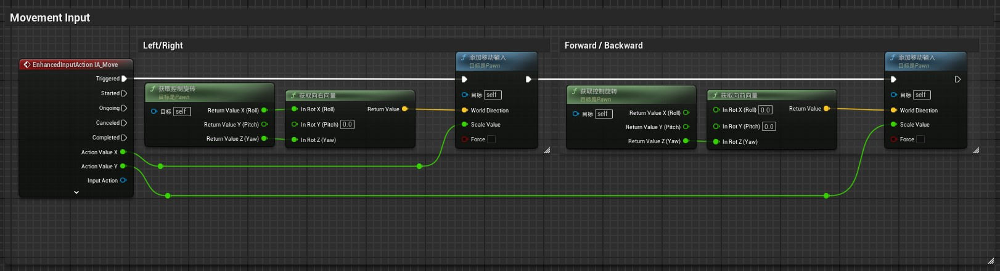

# 
蓝图

当你想直接创建节点而不是从节点的引脚创建时会发现有些节点看不见这时候我们可以关闭搜索框右边的 `context sensitive` 选项

 | 
:-: | :-:
关闭前 | 关闭后

双击连接线可以在连接点上创建一个顶点，有助于整理蓝图减少阅读起来的复杂程度。

# 
第一人称

## 增强输入
1. 分别新建 `输入操作` 分别命名为 `IA_Jump`，`IA_Look`，`IA_Move`
	+ `IA_Jump（跳跃）` 值类型设置为 `数字（布尔）`;
	+ `IA_Look（视角转动）` 值类型设置为 `Axis2D(Vector)`;
	+ `IA_Move（移动）` 值类型设置为 `Axis2D(Vector)`
2. 新建一个`输入映射情景` 命名为 `IMC_Player`
	+ 添加操作映射 `IA_Jump`，设置为`空格键`；
	+ 添加操作映射 `IA_Look`，设置为 `鼠标XY 2D轴`，添加一个修改器设置为`否定`；
	+ 添加操作映射 `IA_Move`，分别设置为`WASD`几个按键，`AS` 需要添加 `否定` 修改器；

## 蓝图实现
1. 我们需要先创建一个角色蓝图类
2. 打开蓝图在 `骨骼网格体` 下新建一个`Camera`
3. 蓝图实现

增强输入

  

跳跃

  

相机视角旋转

  

第一人称移动

  

第三人称移动

  

+ EnhancedInputAction 的接口名称
	+ Triggered：触发状态，表示状态机正在等待某个事件的发生
	+ Started：开始状态，表示状态机已经开始执行。
	+ Ongoing：进行状态，表示状态机正在执行。
	+ Canceled：取消状态，表示状态机已经被取消。
	+ Completed：完成状态，表示状态机已经执行完毕。