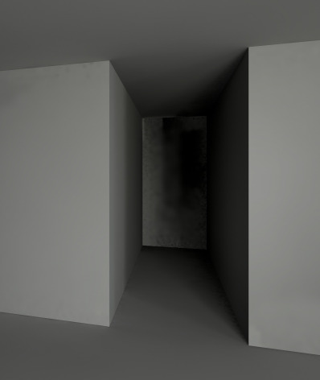
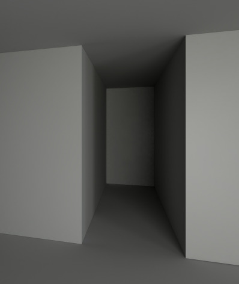
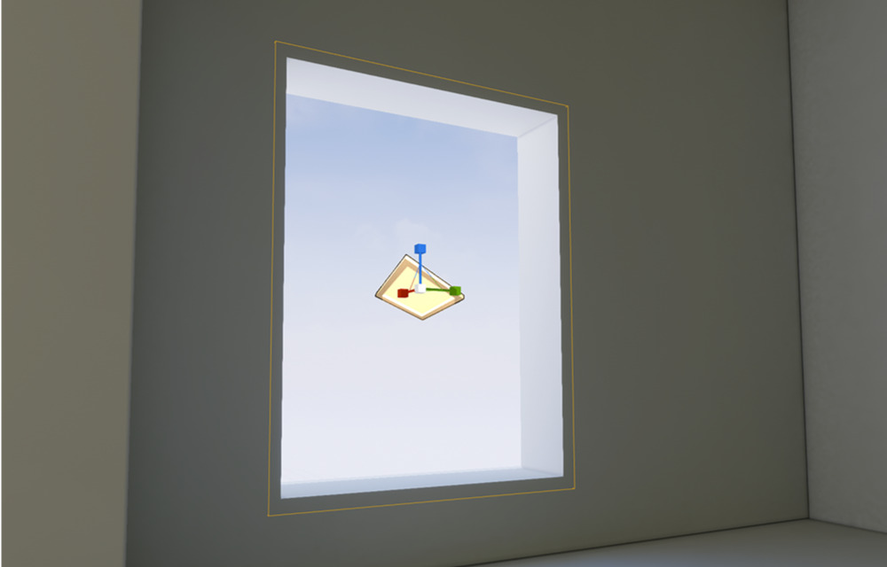
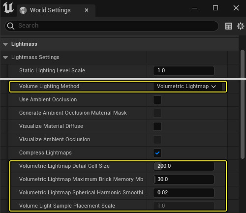

# 模型处理
---
## 导入外部模型
 1. 我使用的是blender导出glb后直接拖入UE5的内容管理器，一般导入的模型是散件但是可以通过导入设置中的 `静态网格体` → `组合静态网格体` 打开这个选项就能让模型变成一个整体，但是缺点是模型这样就不能分开了只能是一整个，具体看使用场景。但是不用急，分散的模型也有办法组合，只要<kbd>shift</kbd>全选网格体拖入3D场景中就会自动组合。
2. 第二种方法是在系统资源管理器中打开本地文件夹，然后把我们的模型直接放在文件中（以后模型要修改直接替换里面的文件），虚幻引擎右下角会弹出提示是否导入模型点击导入我们就能看到导入的设置了。

> 如果导入时候如出现： Mesh has primitives with no materials assigned: Plane.009 ，中文意思是：网格具有未指定材质的基本体：Plane.009，代表Plane.009这个网格并没有被赋予材质。

---
# 静态光照
---
## 关闭默认场景的实时GI
这里还没空写到时候再补！

## 关闭自动曝光

您可能会在你自己做的室内场景中发现一个问题，在一个完全封闭的环境刚开始是一片漆黑但是过一会整个环境就会亮起来，这就是自动曝光造成的。我们可以在项目设置中的  `渲染` → `默认设置` → `自动曝光` 来关闭他。（此类选项按照需要关闭或打开）

## 烘焙光照贴图
烘焙光照贴图能极大的减少计算的效果提升游戏的流畅度，但是缺点是物体只能是静态的不能移动。

0. 烘焙之前我们需要查看物体的光照贴图在3D视图中左上角默认是 `光照` 模式，我们需要把他修改成 `优化视图模式` → `光照贴图密度` 这样我们就能查看模型的光照uv大小；选中物体在 *细节* → *光照* → *覆盖的光照贴图分辨率* 这个选项可以单独调整光照贴图的密度。
1. **烘焙设置** ：主要的烘焙设置在菜单栏 `窗口` → `世界场景设置` 中的*Lightmass设置*；这里可以调整一些具体的烘焙参数。
2. 我们主要调整的参数有 `间接光照反射次数` `天空光照反射次数` `间接光照质量` 以及 `间接光照平滑度`，这几个是我们主要调整的参数，`间接光照平滑度`看情况适当调整，其他3个参数越高效果越好但是要考虑烘焙时间所以也看情况调整。 
3. **烘焙光照** ：菜单栏中 `构建` → `仅构建光照` 就能进行烘焙了

## 室内环境的烘焙需要注意的功能
### Lightmass门户（Lightmass Portal）
在烘焙室内环境 *Lightmass* 时候会出现烘焙出的 *Lightmass* 出现各种 “黑斑 或 阴影部分非常不均匀的问题”

|  | 
:-: | :-:
使用前 | 使用后

`Lightmass门户`（Lightmass Portal）是一个Actor，我们可以在Actor面板中创建他，然后把他放在室内的如窗口之类的位置上；使它的大小与光线的开口或区域大致相同或略小一点就可以了。

|
:-:|:-:

## 自发光材质物体无法烘焙
如果你需要烘焙自发光物体，需要在物体的细节面板中打开 `光照` → `高级` → `自发光光源`

## 体积光照贴图 
> 体积光照贴图将逐渐取代[间接光照缓存](https://docs.unrealengine.com/5.1/zh-CN/indirect-lighting-cache-in-unreal-engine)和体积光照取样。

> 体积光照贴图就相当于Unity中的`光照探针` 只不过虚幻5引擎是自适应的，您不需要去手动调整位置，他会自动帮助您生成一套。

概括起来，体积光照贴图是按下列方式工作的：
-   Lightmass将光照采样放置在关卡中的各个位置，并在光照构建期间为它们计算间接光照。
-   当需要渲染动态Object时，就将体积光照贴图内插到着色的每个像素，提供预计算的间接光照。
-   如果没有构建的光照可用（也就是说Object是新的或者移动过多），就从 **静态** Object的体积光照贴图将光照内插到每个像素，直至光照重构完成为止。

**查看3D视图中的VLM体积光照贴图**
我们可以在3D视图中开启这个选项 `显示` → `可视化` → `体积光照贴图` 

+ **体积光照贴图细节单元格大小（Volumetric Lightmap Detail Cell Size）**  
	+ 最高密度（在几何体周围使用）下的体积光照贴图体素的大小（数值越小密度越高），按世界场景空间单位计。这个设置对于构建时间和内存有很大影响。
	
+ **体积光照贴图最大砖块内存量（Volumetric Lightmap Maximum Brick Memory Mb）**
	+ 要为体积光照贴图砖块数据花费的最大内存量。系统会丢弃高密度砖块，直至达到这一限制为止。先丢弃距离几何体最远的砖块。对内存裁减过多会导致分辨率不一致，因此最好用增大 **体积光照贴图细节单元格大小（Volumetric Lightmap Detail Cell Size）** 来代替。

+ **体积光图球面谐波平滑法（Volumetric Lightmap Spherical Harmonic Smoothing）**
	+ 控制在球面谐波去环过程中，对体积光照贴图采样进行多少程度的平滑处理。每当高方向性的光照信息被保存在球面谐波中时，就会出现一个环形伪影，表现为在另一面出现预期之外的黑色区域。平滑可以减少这种伪影。平滑只有在出现环形伪影时才会应用。**0** = 无平滑，**1** = 强平滑（光照的方向性较小）。

+ **体积光源采样放置缩放（Volume Light Sample Placement Scale）**
	+ 缩放体积光照采样放置时的距离。体积光照采样由Lightmass计算，用于可移动组件上的GI。使用较大的缩放值时，采样的内存占用较低，还能降低间接光照缓存的更新时间，但光照区域之间过渡的准确程度会下降。

## 灯光出现红叉

 出现原因主要是因为这块区域中光源数量太多，可以直接把光源之间的间隙放远一些就可解决，如果红叉还在需要手动重新加载一下场景。如果实在是需要那么多光源可以考虑如下方法。

第一种：将光源由固态改为静态或者动态

第二种：关闭该光源的阴影

